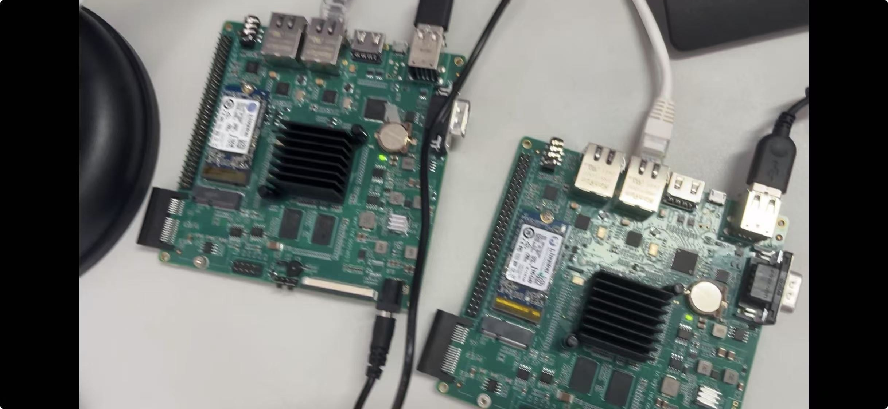
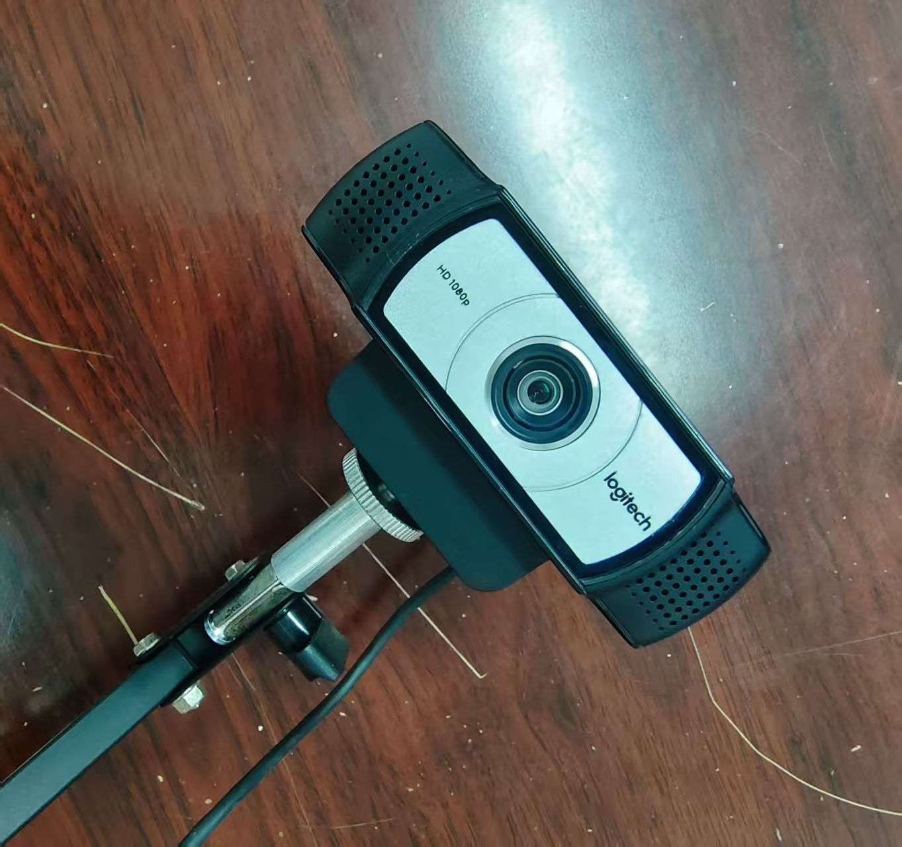
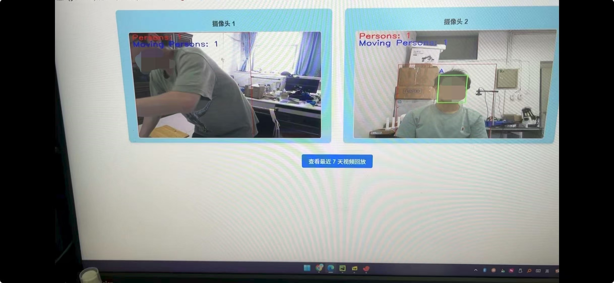
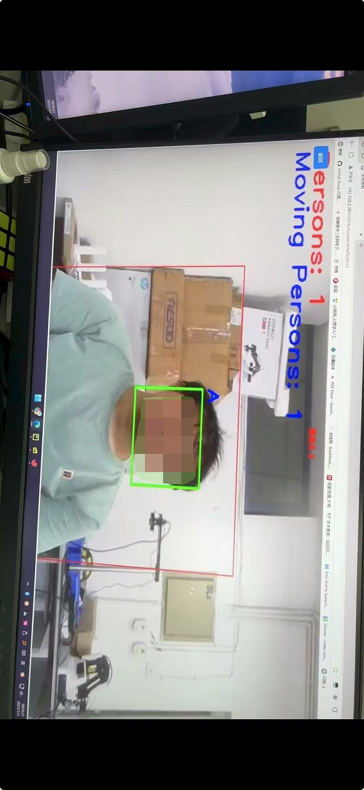
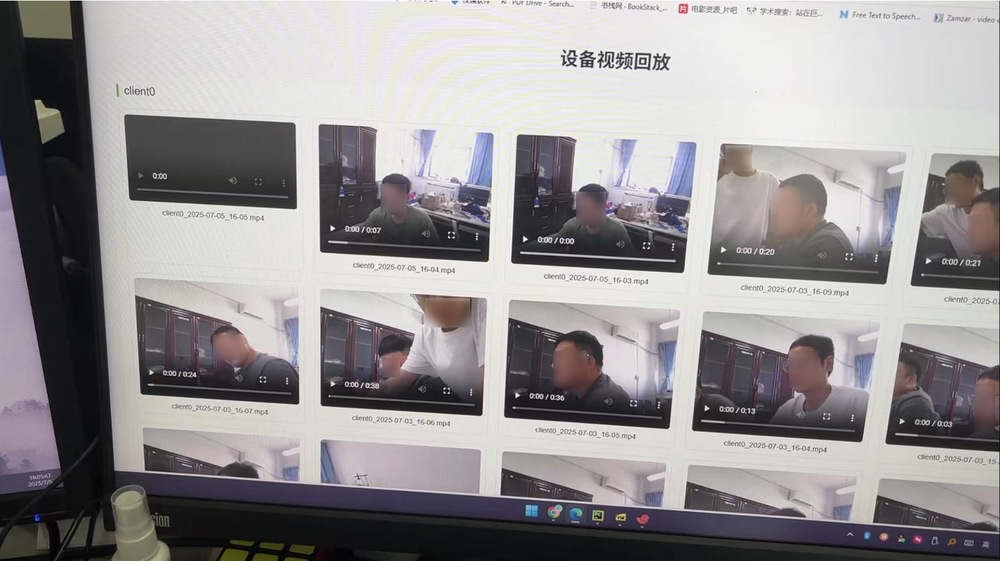

# 1、整体界面

整体一共两个设备端，连线情况如图所示，包括供电线、网线、摄像头线。

USB免去摄像头，包括音频。

# 2、软件界面

软件包括主页，全屏显示，查看7天历史回放记录界面分别如图5、6、7所示。

如图所示，客户端自动连接摄像头连接的主控芯片，把处理后的视频数据显示在指定区域，单击某个摄像头视频区域可进入全屏模式，实时监控界面左上角显示当前界面总人数，移动的人数，以及检测到的人脸，通过人脸识别模型，对采集的人脸数据和人脸数据库进行自动识别，并显示识别的人名，未识别的人脸显示“unknown”。如图6所示，对检测的人和人脸都用矩形框进行实时标注。

如图所示，显示所有设备的历史回放，历史文件名以时间格式命名，查看某个时刻的历史视频，可以通过文件名进行查询观看。所有客户端部署在局域网服务器上，后期可推广到云服务器，通过手机app、微信小程序等实现远程查看，监控，预警等。
